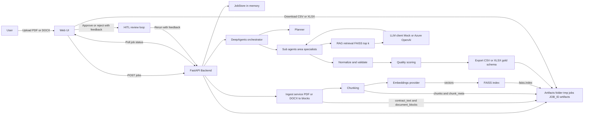

## System Overview

```mermaid
flowchart LR
  U[User] -->|Upload PDF or DOCX| UI[Web UI]
  UI -->|POST jobs| API[FastAPI Backend]

  API --> JOBS[JobStore in memory]
  API --> ART[Artifacts folder tmp jobs JOB_ID artifacts]

  API --> ING[Ingest service PDF or DOCX to blocks]
  ING -->|contract_text and document_blocks| ART

  ING --> CH[Chunking]
  CH --> EMB[Embeddings provider]
  EMB -->|vectors| FAISS[FAISS index]
  CH -->|chunks and chunk_meta| ART
  FAISS -->|faiss.index| ART

  API --> DA[DeepAgents orchestrator]
  DA --> PLN[Planner]
  DA --> SUB[Sub agents area specialists]
  SUB --> RET[RAG retrieval FAISS top k]
  RET --> LLM[LLM client Mock or Azure OpenAI]
  LLM --> SUB
  SUB --> NORM[Normalize and validate]
  NORM --> SCORE[Quality scoring]
  SCORE --> EXP[Export CSV or XLSX gold schema]
  EXP --> ART

  UI <-->|Poll job status| API
  UI -->|Download CSV or XLSX| ART
  UI -->|Approve or reject with feedback| HITL[HITL review loop]
  HITL -->|Rerun with feedback| API
```

