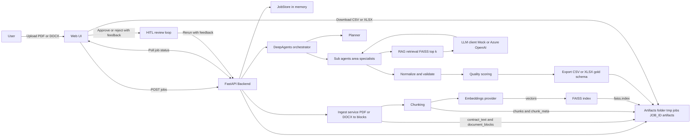
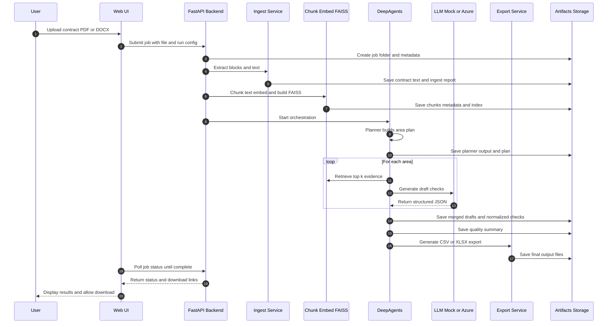
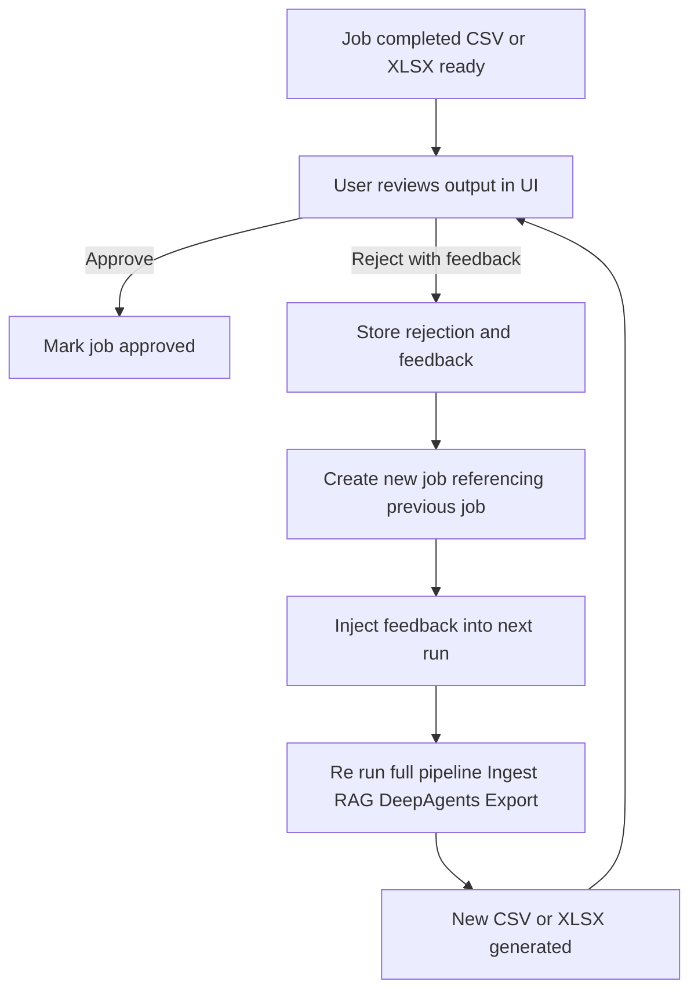
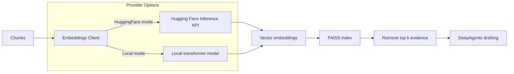
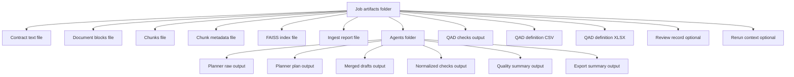

## QAD(Quality Assurance Directive) DeepAgents

Agentic Contract Intelligence with Retrieval-Augmented Generation
Upload a contract.
Generate structured quality definition packages.
Review, refine, and re-run with human feedback.

### Executive Summary

QAD DeepAgents is an end-to-end AI system that transforms contract documents (PDF or DOCX) into structured, schema-aligned quality definition outputs using a modular multi-agent architecture.
The project demonstrates:

- Agentic workflow orchestration
- Retrieval-Augmented Generation (RAG)
- Structured LLM output pipelines
- Embedding provider abstraction (remote + local)
- Human-in-the-loop feedback loops
- Artifact-based traceability
- Production-style backend architecture

### User Interface

Below is the contract submission interface used to initiate AI workflows:

The UI supports:

- PDF or DOCX upload
- Optional metadata inputs
- Real-time job polling
- CSV/XLSX export downloads
- Human-in-the-loop approval and re-run cycle

# System Architecture

## High-Level Overview

### Architectural Highlights

- Modular service boundaries
- Isolated job-level artifact storage
- Deterministic orchestration flow
- Feedback-aware regeneration
- Pluggable embedding providers
- LLM abstraction (mock or Azure OpenAI)

## End-to-End Execution Flow

## Human In The Loop Review Cycle
The system is not purely autonomous. It incorporates a structured feedback loop.
### Review & Regeneration Cycle

### Why This Matters

- Enables controlled AI deployment
- Supports human validation in regulated workflows
- Creates an iterative refinement loop
- Enforce applied AI governance design

## Embeddings Provider Architecture
The system supports both remote and local embedding strategies.

### Embedding Modes

Remote (Default)
- Lightweight
- No large model downloads
- Ideal for public deployments

Local (Optional)
- Fully offline capable
- Requires additional dependencies
- Suitable for restricted environments

## Job Artifacts Layout
Each run generates a full artifact trail for observability and debugging.

### This artifact-first design enables:
- Deterministic debugging
- Run reproducibility
- Prompt iteration workflows
- Structured evaluation pipelines

## Running the Project
### Create Virtual Environment
python -m venv .venv

Activate:

### Windows
.\.venv\Scripts\Activate.ps1
### Mac/Linux
source .venv/bin/activate

## Install Dependencies
pip install -r requirements.txt

Optional local embeddings:

pip install -r requirements-local.txt

## Configure Environment
Copy example:

cp .env.example .env

Edit:

EMBEDDINGS_PROVIDER=huggingface

HF_TOKEN=optional

## Start Server
uvicorn app.main:app --reload

Open:
http://127.0.0.1:8000

## Tech Stack
- FastAPI
- FAISS
- Hugging Face Inference API
- sentence-transformers (optional local)
- Uvicorn
- HTML/CSS frontend

