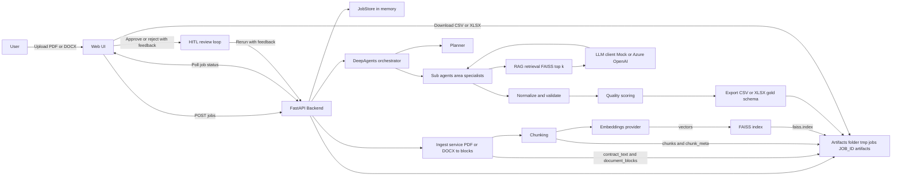
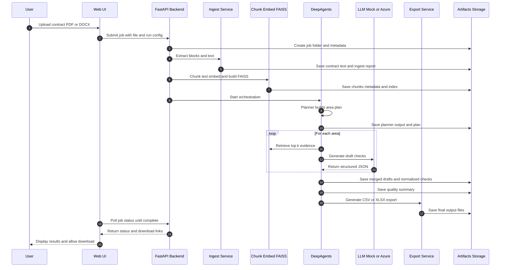

## System Overview

```mermaid
flowchart LR
  U[User] -->|Upload PDF or DOCX| UI[Web UI]
  UI -->|POST jobs| API[FastAPI Backend]

  API --> JOBS[JobStore in memory]
  API --> ART[Artifacts folder tmp jobs JOB_ID artifacts]

  API --> ING[Ingest service PDF or DOCX to blocks]
  ING -->|contract_text and document_blocks| ART

  ING --> CH[Chunking]
  CH --> EMB[Embeddings provider]
  EMB -->|vectors| FAISS[FAISS index]
  CH -->|chunks and chunk_meta| ART
  FAISS -->|faiss.index| ART

  API --> DA[DeepAgents orchestrator]
  DA --> PLN[Planner]
  DA --> SUB[Sub agents area specialists]
  SUB --> RET[RAG retrieval FAISS top k]
  RET --> LLM[LLM client Mock or Azure OpenAI]
  LLM --> SUB
  SUB --> NORM[Normalize and validate]
  NORM --> SCORE[Quality scoring]
  SCORE --> EXP[Export CSV or XLSX gold schema]
  EXP --> ART

  UI <-->|Poll job status| API
  UI -->|Download CSV or XLSX| ART
  UI -->|Approve or reject with feedback| HITL[HITL review loop]
  HITL -->|Rerun with feedback| API
```

## End to End Job Sequence

```mermaid
sequenceDiagram
  autonumber
  participant U as User
  participant UI as Web UI
  participant API as FastAPI Backend
  participant ING as Ingest Service
  participant RAG as Chunk Embed FAISS
  participant DA as DeepAgents
  participant LLM as LLM Mock or Azure
  participant EXP as Export Service
  participant ART as Artifacts Storage

  U->>UI: Upload contract PDF or DOCX
  UI->>API: Submit job with file and run config
  API->>ART: Create job folder and metadata
  API->>ING: Extract blocks and text
  ING->>ART: Save contract text and ingest report

  API->>RAG: Chunk text embed and build FAISS
  RAG->>ART: Save chunks metadata and index

  API->>DA: Start orchestration
  DA->>DA: Planner builds area plan
  DA->>ART: Save planner output and plan

  loop For each area
    DA->>RAG: Retrieve top k evidence
    DA->>LLM: Generate draft checks
    LLM-->>DA: Return structured JSON
  end

  DA->>ART: Save merged drafts and normalized checks
  DA->>ART: Save quality summary

  DA->>EXP: Generate CSV or XLSX export
  EXP->>ART: Save final output files

  UI->>API: Poll job status until complete
  API-->>UI: Return status and download links
  UI-->>U: Display results and allow download
```

